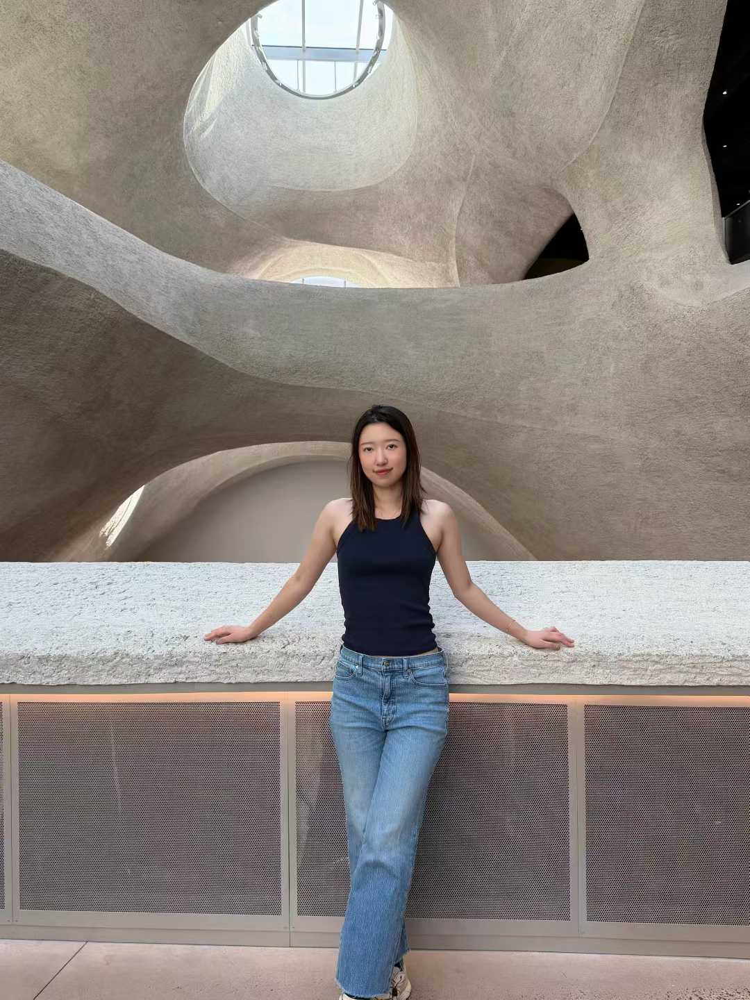
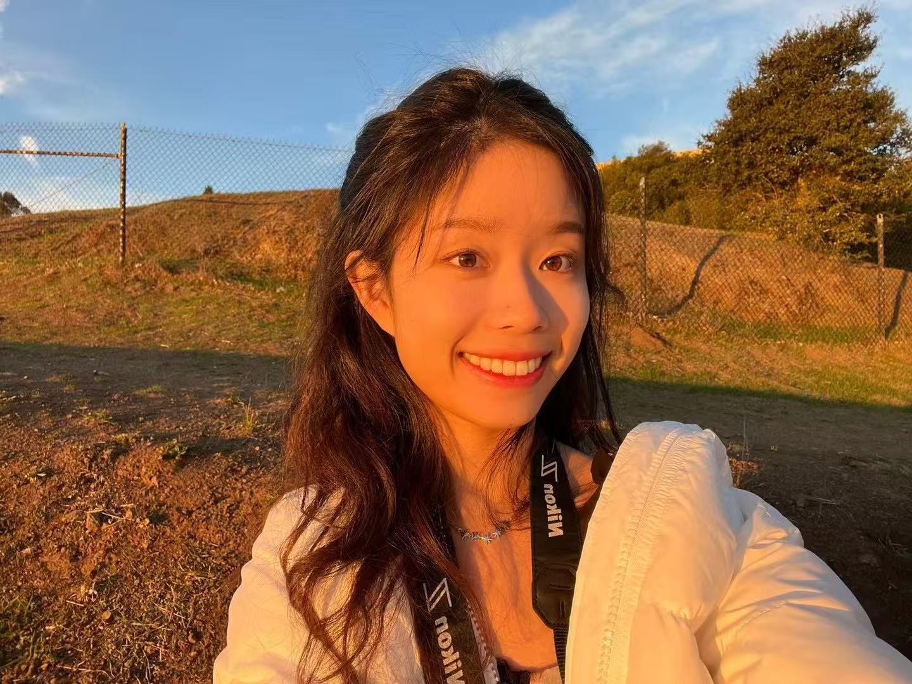
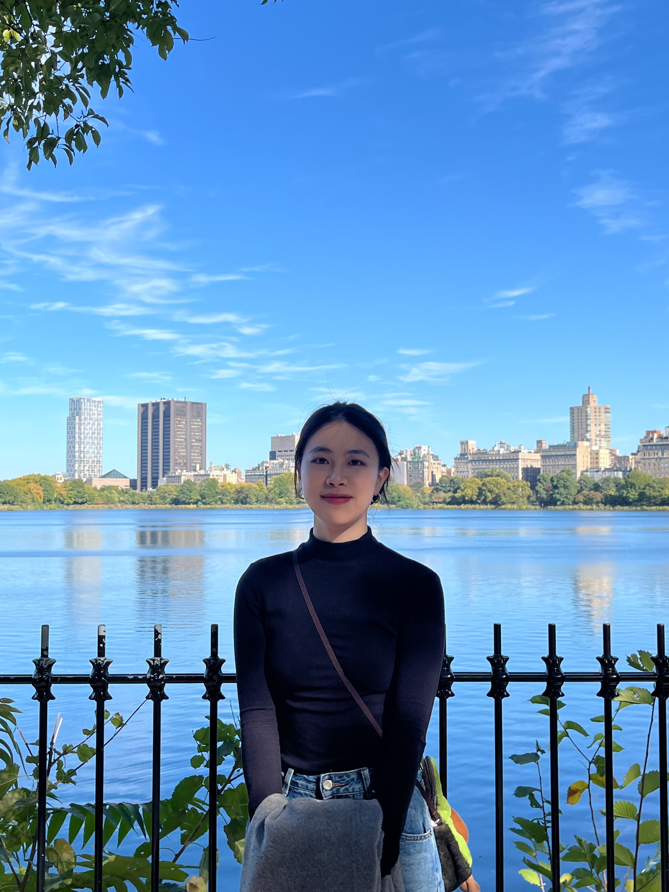

We are a data science and biostatistics team collaborating on the P8105 final project, focusing on high-cost patients in the 2023 MEPS data.

Yuanyuan Zhang

Team Member

<a class="team-icon-circle" href="https://github.com/czyuan02" target="_blank"><i class="fab fa-github"></i></a><a class="team-icon-circle" href="https://www.linkedin.com/in/yuanyuan-zhang-8b006a1bb/" target="_blank"><i class="fab fa-linkedin-in"></i></a>

Charline Gu

Team Member

<a class="team-icon-circle" href="https://github.com/charlinee1" target="_blank"><i class="fab fa-github"></i></a><a class="team-icon-circle" href="https://www.linkedin.com/in/jinghg/" target="_blank"><i class="fab fa-linkedin-in"></i></a>

Yaxuan Deng

Team Member

<a class="team-icon-circle" href="https://github.com/Dia_xuan" target="_blank"><i class="fab fa-github"></i></a><a class="team-icon-circle" href="https://www.linkedin.com/in/yaxuan-deng-955604336" target="_blank"><i class="fab fa-linkedin-in"></i></a>

Wen Li

Team Member

<a class="team-icon-circle" href="https://github.com/wl-85" target="_blank"><i class="fab fa-github"></i></a><a class="team-icon-circle" href="www.linkedin.com/in/wen-li-wl03851" target="_blank"><i class="fab fa-linkedin-in"></i></a>

